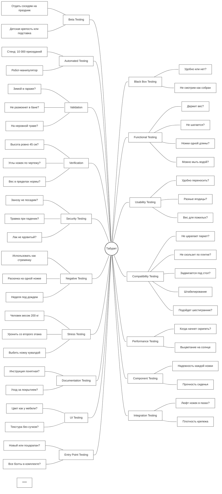

# Лабораторная работа 4

```mermaid
graph LR
    Root((Табурет))

    Beta[Beta Testing] --> Root
    Auto[Automated Testing] --> Root
    Val[Validation] --> Root
    Ver[Verification] --> Root
    Sec[Security Testing] --> Root
    Neg[Negative Testing] --> Root
    Stress[Stress Testing] --> Root
    Doc[Documentation Testing] --> Root
    UI[UI Testing] --> Root
    Entry[Entry Point Testing] --> Root

    Root --> BB[Black Box Testing]
    Root --> Func[Functional Testing]
    Root --> Usab[Usability Testing]
    Root --> Comp[Compatibility Testing]
    Root --> Perf[Performance Testing]
    Root --> CompT[Component Testing]
    Root --> Integ[Integration Testing]

    B1[Отдать соседям на праздник] --> Beta
    B2[Детская крепость или подставка] --> Beta
    
    A1[Стенд: 10 000 приседаний] --> Auto
    A2[Робот-манипулятор] --> Auto
    
    V1[Зимой в гараже?] --> Val
    V2[Не размокнет в бане?] --> Val
    V3[На неровной траве?] --> Val
    
    Vr1[Высота ровно 45 см?] --> Ver
    Vr2[Углы ножек по чертежу?] --> Ver
    Vr3[Вес в пределах нормы?] --> Ver
    
    S1[Занозу не посадим?] --> Sec
    S2[Травма при падении?] --> Sec
    S3[Лак не ядовитый?] --> Sec
    
    N1[Использовать как стремянку] --> Neg
    N2[Раскачка на одной ножке] --> Neg
    N3[Неделя под дождем] --> Neg
    
    St1[Человек весом 200 кг] --> Stress
    St2[Уронить со второго этажа] --> Stress
    St3[Выбить ножку кувалдой] --> Stress
    
    D1[Инструкция понятная?] --> Doc
    D2[Уход за покрытием?] --> Doc
    
    U1[Цвет как у мебели?] --> UI
    U2[Текстура без сучков?] --> UI
    
    E1[Новый или поцарапан?] --> Entry
    E2[Все болты в комплекте?] --> Entry

    BB --> BB1[Удобно или нет?]
    BB --> BB2[Не смотрим как собран]
    
    Func --> F1[Держит вес?]
    Func --> F2[Не шатается?]
    Func --> F3[Ножки одной длины?]
    Func --> F4[Можно мыть водой?]
    
    Usab --> Us1[Удобно переносить?]
    Usab --> Us2[Разные ягодицы?]
    Usab --> Us3[Вес для пожилых?]
    
    Comp --> C1[Не царапает паркет?]
    Comp --> C2[Не скользит по плитке?]
    Comp --> C3[Задвигается под стол?]
    Comp --> C4[Штабелирование]
    Comp --> C5[Подойдет шестигранник?]
    
    Perf --> P1[Когда начнет скрипеть?]
    Perf --> P2[Выцветание на солнце]
    
    CompT --> CT1[Надежность каждой ножки]
    CompT --> CT2[Прочность сиденья]
    
    Integ --> I1[Люфт ножек в пазах?]
    Integ --> I2[Плотность крепежа]

    linkStyle default interpolate basis stroke:#333,stroke-width:1px,marker-end:none;
    classDef default fill:#fff,stroke:#333,stroke-width:1px;
    classDef root fill:#fff,stroke:#333,stroke-width:2px,font-size:16px;
    class Root root;
****
```
