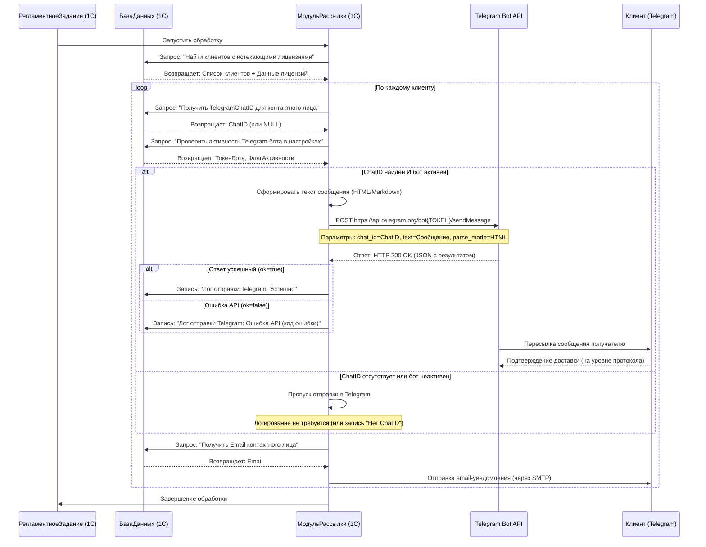
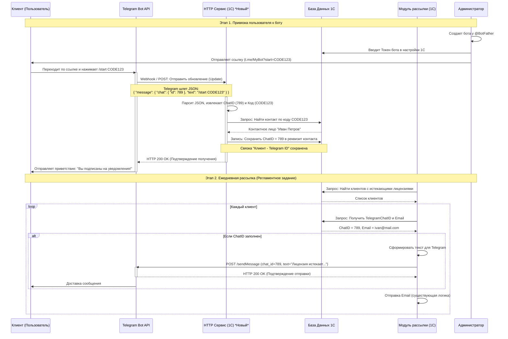

# Техническое задание: Доработка модуля уведомлений (Интеграция с Telegram Bot)

## 1. Цель доработки
Расширить функционал существующего модуля отправки уведомлений об окончании лицензий. Добавить возможность дублирования уведомлений в Telegram параллельно с отправкой на email для повышения гарантии доставки важных сообщений клиентам.

## 2. Общая логика работы
1. Существующий регламентный или фоновый процесс отбирает клиентов с истекающими лицензиями.
2. В процессе формирования уведомления модуль должен определить, есть ли у клиента (контрагента/контактного лица) актуальный **Telegram Chat ID**.
3. Если Chat ID найден, сформировать текст сообщения (аналогичный email-уведомлению или короче) и отправить его через Telegram Bot API.
4. Логирование результатов отправки ведется в существующий или новый регистр сведений (или в журнал регистрации), аналогично email-рассылке.

## 3. Требования к настройкам (Необходимо добавить в программу)

Для работы механизма необходимо предусмотреть место хранения настроек подключения к Telegram.

### 3.1. Регистр настроек Telegram
Создать (или использовать существующий) регистр настроек, например, **"РегистрСведений.НастройкиTelegramBot"**.
*   **Измерения**: Не требуются (одна запись для всех).
*   **Ресурсы**:
    *   `ТокенБота` (Строка, 100) — токен, полученный от `@BotFather`.
    *   `Активность` (Булево) — флаг, включающий/отключающий рассылку через Telegram (на случай проблем с ботом).
*   **Управление**: Добавить форму настройки (или вкладку в существующие настройки обмена), где администратор может ввести Токен и включить/выключить флаг "Использовать Telegram".

### 3.2. Справочник "Контактные лица" (или "Контрагенты")
Необходимо место для хранения `ChatID` клиента.
*   В существующий справочник **"Контактные лица"** (или в реквизиты контрагента) добавить новый реквизит:
    *   **Имя**: `TelegramChatID` (Строка, 50).
    *   **Синоним**: "ID чата Telegram".
*   *Важно:* Программист должен понимать, что Chat ID для личных сообщений (User ID) и для групп — это разные вещи. Обычно рассылка идет в личку пользователю.

### 3.3. Обработка для привязки (Опционально, но желательно)
Чтобы наполнять базу ChatID, хорошо бы сделать механизм регистрации. Самый простой вариант — создать отдельную обработку, которая генерирует ссылку-приглашение для клиента.
*   Клиенту отправляется ссылка типа: `https://t.me/ИмяБота?start=КодКонтрагентаИлиКонтактногоЛица`.
*   Когда клиент нажимает "Старт", бот должен ответить приветствием и сохранить связку `ChatID - Код` в базу 1С.
*   **Задача для программиста:** Если текущий стек технологий позволяет (например, есть внешний веб-сервис/обработка, принимающая HTTP-запросы), реализовать простой HTTP-сервис в 1С, который будет принимать POST/GET запросы от Telegram при старте бота и записывать ChatID в справочник.

## 4. Требования к отправке сообщений

### 4.1. Формирование текста
*   Текст сообщения должен быть кратким и информативным, так как в Telegram лучше читаются короткие сообщения.
*   Желательно использовать форматирование Markdown или HTML (жирный, курсив) для улучшения читаемости.
*   **Пример текста:**
    > *Внимание!*
    > Уважаемый [ИмяКлиента]!
    > Срок действия лицензии на продукт "[НаименованиеПО]" заканчивается **[ДатаОкончания]**.
    >
    > Пожалуйста, свяжитесь с менеджером для продления.

### 4.2. Механизм отправки
*   Создать общий модуль, например, `РаботаСТелеграм`. Функции должны быть экспортными.
*   **Функция ОтправитьСообщениеВТелеграм(Текст, ChatID)**
    *   *Параметры:* Текст сообщения, ID получателя.
    *   *Логика:* Выполнить HTTP-запрос (POST) к API:
        `https://api.telegram.org/bot<ТокенБота>/sendMessage`
    *   *Параметры запроса:* `chat_id = ChatID`, `text = Текст`, `parse_mode = HTML`.
    *   *Результат:* Возвращать признак успеха (Булево) и текст ошибки (для записи в лог).

### 4.3. Интеграция с существующим модулем рассылки
В месте формирования email-уведомления добавить следующий код (псевдокод):
```1c
Если НастройкиTelegram.Активность Тогда
    // Получаем ChatID контактного лица
    ChatID = КонтактноеЛицо.TelegramChatID;
    
    Если ЗначениеЗаполнено(ChatID) Тогда
        ТекстТГ = ПолучитьТекстДляТелеграм(ДанныеКлиента); // Функция формирования короткого текста
        Успешно = РаботаСТелеграм.ОтправитьСообщениеВТелеграм(ТекстТГ, ChatID);
        
        Если Успешно Тогда
            // Записать в лог: "Отправлено в Telegram OK"
        Иначе
            // Записать в лог: "Ошибка отправки в Telegram: ..."
        КонецЕсли;
    КонецЕсли;
КонецЕсли;
```

## 5. Обработка ошибок и логирование
*   Все ошибки подключения к API Telegram (неверный токен, нет интернета, заблокированный бот) должны перехватываться и записываться в **Журнал регистрации**.
*   Желательно добавить отчет по доставке сообщений (по аналогии с email), где будет видно, кому ушло сообщение в Telegram, а кому нет.

## 6. Примерный план работ для программиста
1.  Анализ текущего модуля отправки email-уведомлений.
2.  Создание регистра настроек и добавление реквизита `TelegramChatID` в справочник "Контактные лица".
3.  Разработка общего модуля `РаботаСТелеграм` с функцией отправки.
4.  (Опционально) Разработка HTTP-сервиса для автоматической регистрации ChatID.
5.  Доработка существующего процесса отправки уведомлений (добавление вызова Telegram-функции).
6.  Тестирование отправки.

### 7. Схема работы без автоматической привязки



### 8. Схема с автоматической привязкой


